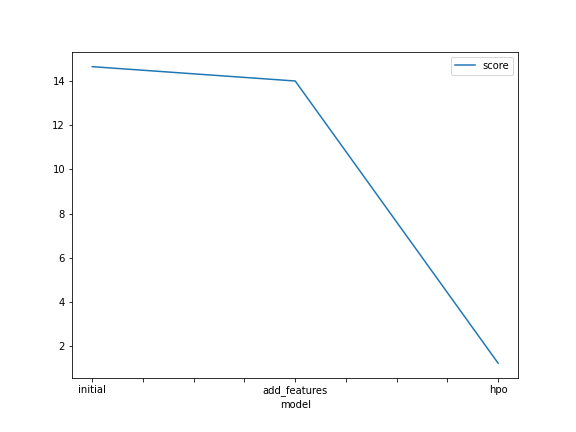
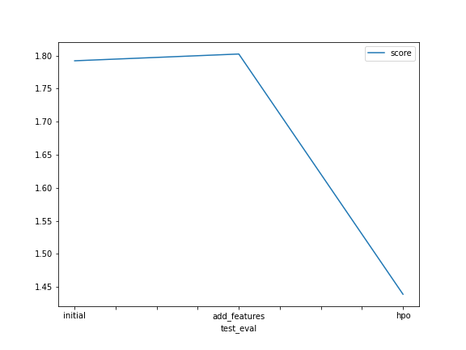

# Report: Predict Bike Sharing Demand with AutoGluon Solution
#### Owoicho Joshua Odinya

## Initial Training
### What did you realize when you tried to submit your predictions? What changes were needed to the output of the predictor to submit your results?
TODO: When I tried submitting my predictions during the initial training of my model, I noticed that there a few negative values in my predictions and I was unable to properly submit my results. So I had to make changes to my outputs of the predictor by changing the negative values to zero.

### What was the top ranked model that performed?
TODO: According to my initial trained model, the top ranked model that performed is WeightedEnsemble_L3

## Exploratory data analysis and feature creation
### What did the exploratory analysis find and how did you add additional features?
TODO: The exploratory data analysis found out that the data was not skewed, though it wasn't normalized with zero mean. I also added additional features using datetime parsing.

### How much better did your model preform after adding additional features and why do you think that is?
TODO: My model kid of performed a little worse after adding additional features. I think that was so because they were not scaled after adding

## Hyper parameter tuning
### How much better did your model preform after trying different hyper parameters?
TODO: My model performed way better after trying different hyper parameters.

### If you were given more time with this dataset, where do you think you would spend more time?
TODO: If I was given more time with this dataset I would spend more time on adding more features to the dataset while also scaling it. 

### Create a table with the models you ran, the hyperparameters modified, and the kaggle score.
|model|time_limit|presets|hyperparameters|score|
|--|--|--|--|--|
|initial|600|best_quality|default|1.79205|
|add_features|600|best_quality|default|1.80230|
|hpo|900|good_quality|default|1.43887|

### Create a line plot showing the top model score for the three (or more) training runs during the project.

TODO: Replace the image below with your own.

### Create a line plot showing the top kaggle score for the three (or more) prediction submissions during the project.

TODO: Replace the image below with your own.

## Summary
TODO: This project enabled me to fully understand and demonstrate my ability to train, tune and evaluate models in general and also in a competition setting.
